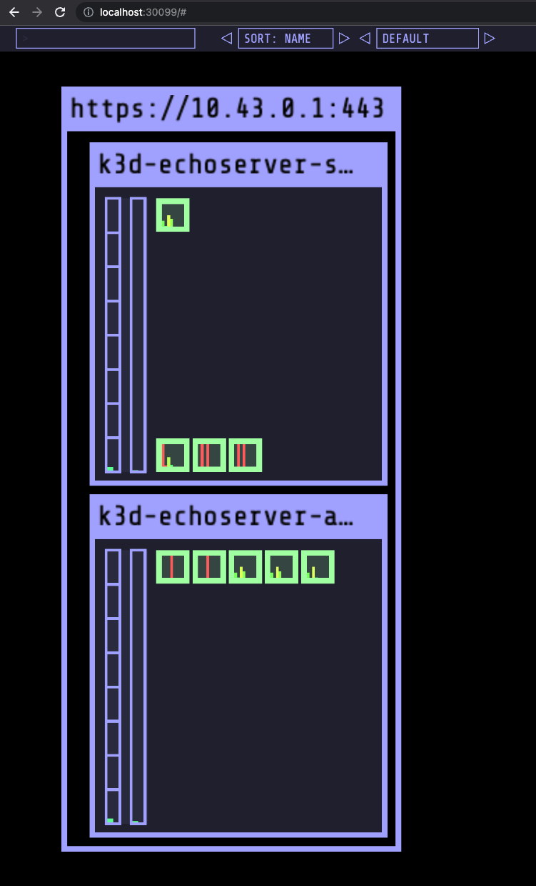

# echoserver

```
                       _/
    _/_/      _/_/_/  _/_/_/      _/_/      _/_/_/    _/_/    _/  _/_/  _/      _/    _/_/    _/  _/_/
 _/_/_/_/  _/        _/    _/  _/    _/  _/_/      _/_/_/_/  _/_/      _/      _/  _/_/_/_/  _/_/
_/        _/        _/    _/  _/    _/      _/_/  _/        _/          _/  _/    _/        _/
 _/_/_/    _/_/_/  _/    _/    _/_/    _/_/_/      _/_/_/  _/            _/        _/_/_/  _/
 ```

echoserver is an HTTP server implementation that is useful for testing out provisioning
infrastructure or for testing application integration with a third-party API.

The implementation is created in Go utilizing [Cobra](https://github.com/spf13/cobra) 
and the [gorilla/mux](https://github.com/gorilla/mux) libraries.

## Getting started

## make commands

```
Usage:
  make <target>

Targets:
  uninstall            Delete all of the plugins/tools versions of the asdf apps. Mainly for testing if install works.
  install              Install all plugins/tool versions of asdf apps.
  begin                Install all dependencies and create the cluster, installing all of the infrastructure.
  create               Creates the cluster and adds the baseline resources.
  kustomize            Install Kustomize files.
  destroy              WARNING: Destroys the cluster entirely!
  start                Starts the cluster from suspension. The cluster must be created first before this can work.
  stop                 Stops the cluster, putting into suspension. The cluster must have been created and running for this to work.
  up                   Start the Tilt server.
  exec                 Exec into a pod in the cluster for testing purposes.
  watch                Run gow to restart the server on file saves.
  build                Build the server for the current architecture
  build-linux          Build the server for the linux architecture
  build-docker         Build a Docker image of the server
  run                  Run the application in a container
  help                 Show help
```

**Dependencies**:
- [go 1.17](https://go.dev/) (Required)

You can start the project by running the server:
```
go run main.go
```

Then in a browser window or in another shell you can execute commands to the server:
```
$ curl http://localhost:8080/200
```

### Configuration
```
An HTTP echo server implementation in Go. This will echo back to you the status
code and information you send it. This is useful for testing infrastructure.

Usage:
  echoserver [flags]
  echoserver [command]

Available Commands:
  completion  Generate the autocompletion script for the specified shell
  help        Help about any command
  live        Check for liveness file.

Flags:
      --banner                 Print the banner on server start. (default true)
      --config string          config file (default is $HOME/.echo.yaml)
  -h, --help                   help for echoserver
      --host string            The host to run the server on. (default "localhost")
      --idle-timeout int       Idle timeout in seconds. (default 60)
      --liveness-path string   Path to put the liveness file. (default "/tmp/echoserver-live")
      --log-level string       Logging level. Valid choices are 'info', 'debug', and 'trace'. (default "info")
      --metrics-port int       The metrics port to run the server on. This can be the same as the host port, but is set to a separate port by default for security. (default 9000)
      --port int               The port to run the server on. (default 8080)
      --read-timeout int       Read timeout in seconds. (default 15)
      --wait int               Wait timeout in seconds. (default 15)
      --write-timeout int      Write timeout in seconds. (default 15)

Use "echoserver [command] --help" for more information about a command.
```

## Local Kubernetes Development Example

This project comes with an example deployment into a local Kubernetes cluster using `k3d`.

**Dependencies**:
- [make](https://gnu.org/software/make/) (Not required, but encouraged for convenience of commands)
- [Docker](https://https://www.docker.com/) (Required for local Kubernetes development/examples)
- [asdf-vm](https://asdf-vm.com/) (Not required, but encouraged to manage dependencies)
- [k3d](https://k3d.io/) (Required only for local Kubernetes development/examples)
- [Tilt](https://tilt.dev/) (Convenient for local Kubernetes development)
- [kubectl](https://kubernetes.io/docs/tasks/tools/) (Convenient for local Kubernetes development)

This project utilizes the excellent [asdf version manager](https://github.com/asdf-vm/asdf) to 
manage all dependencies outside of Docker and `make`. `asdf` is not required, but it makes the
installation easier.

To get started, you can 
[install asdf](http://asdf-vm.com/guide/getting-started.html#getting-started) and utilize the 
provided `make install` command, or you can install the versions of the applications in the 
[.tool-versions](./.tool-versions) file directly.

From there, the rest of the `make` commands should get you started.

### Default configuration

The [k3d config file](./k3d-config.yaml) file has all of the default configuration for the project.
By default, ports `30080-30099` will be allocated on the host machine for services running in the
cluster. If any of these ports are already taken by another process on the host, the creation of
the cluster will fail.

The cluster is started with 1 server (control plane node) and 1 agent (worker node). Traefik is
disabled due to a limitation on how services are exposed in k3d. Allocating the default set of 
ports and using `NodePort` to set up the services made the process a lot easier.

### kube-ops-view

The [kube-ops-view](https://codeberg.org/hjacobs/kube-ops-view) project is installed into the
cluster when running the `begin` or `kustomize` commands. This will take the Kustomization files
from the `hjacobs` repo and install kube-ops-view directly into the cluster. Kube-ops-view can
then be accessed by going to [http://localhost:30099](http://localhost:30099) in the browser.



### exec-pod

For convenience, an execution pod is installed into the cluster. This allows you to run commands
and install software inside of an [alpine](https://alpinelinux.org/) container to run commands on
the cluster, if you wish. This is useful for mocking out a service that is running inside of the
cluster.

```
$ make exec
```
Which is the same as:
```
$ kubectl --namespace default exec --stdin=true --tty=true pod/exec-pod -- sh
```


